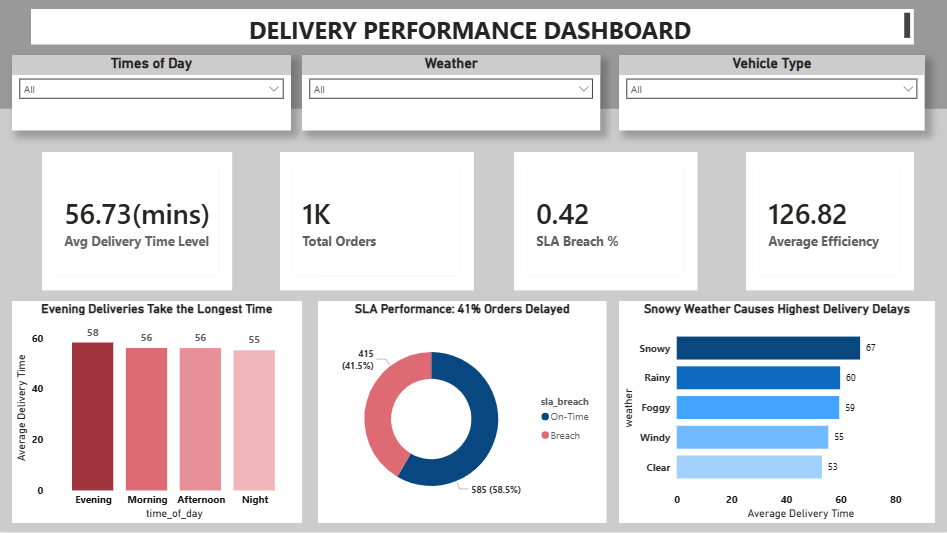
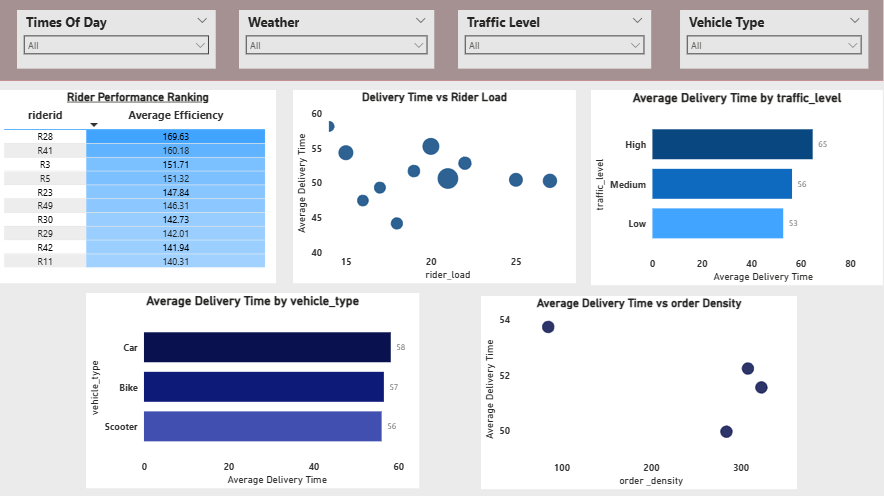
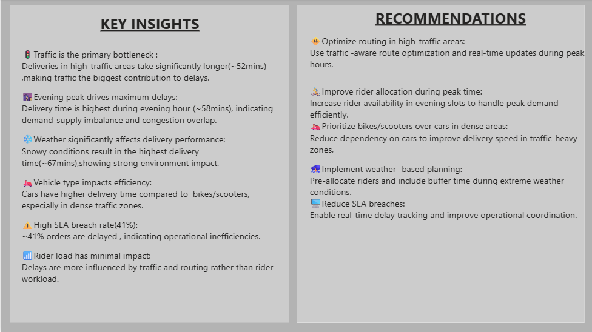

📊Delivery Performance Analysis Dashboard

📌Project Overview
This project analyzes food delivery
operations using SQL and PowerBI to 
identify key factors affecting delivery
time and operational efficiency.The goal is to uncover bottlenecks 
and provide actionable insights.

📊Key Insights

🚦Traffic is the biggest bottleneck,
increasing delivery time

🌃Evening hours have the highest
delays(~58mins)

❄️Weather(snowy) causes highest
delivery time(~67mins)

🚘Cars are slowe than bikes/
scooter in dense areas

⚠️41% orders are delayed
(SLA Breach)

👨‍🦰Rider load has less impact 
compared to traffic

⚙️Tools Used
SQL
Power BI
Excel

📂Project Files
📊Dataset:[Download Dataset](./Food_Delivery_Times.csv.xlsx)

📈Dashboard:[View Dashboard File](./delivery_dashboard.pbix)

🧠SQL Queries:[View Queries](./delivery_insights_queries.sql)

📷Dashboard Preview
Overview Dashboard:

Rider and Delivery Analysis:

Insights and Recommendation:

💡Recommendations
Optimize routing in high traffic areas

Increase riders during peak hours

Prefer bikes/scooters in traffic zones

Use weather based planning 

Improve SLA tracking

🚀Conclusion
This project shows how data analysis can improve delivery efficiency using SQL and PowerBI
